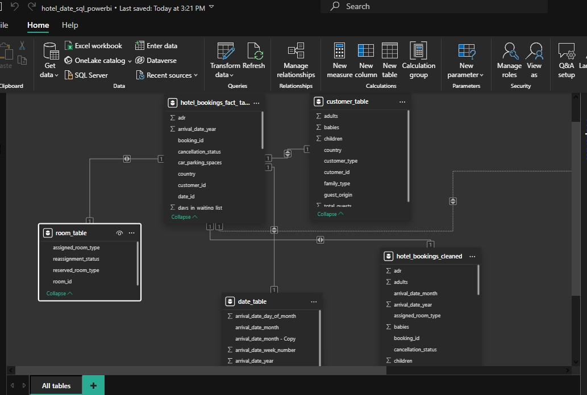
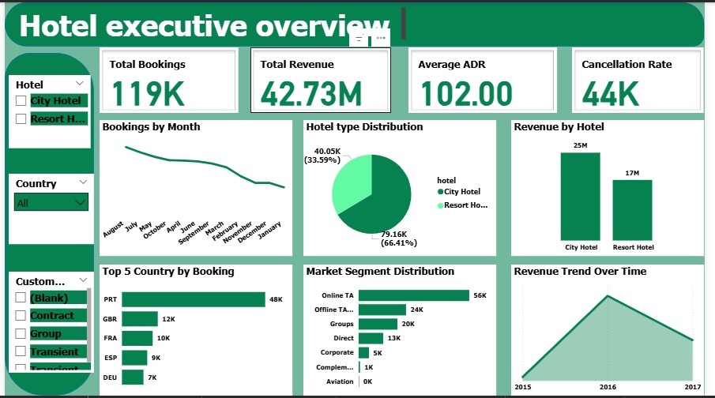
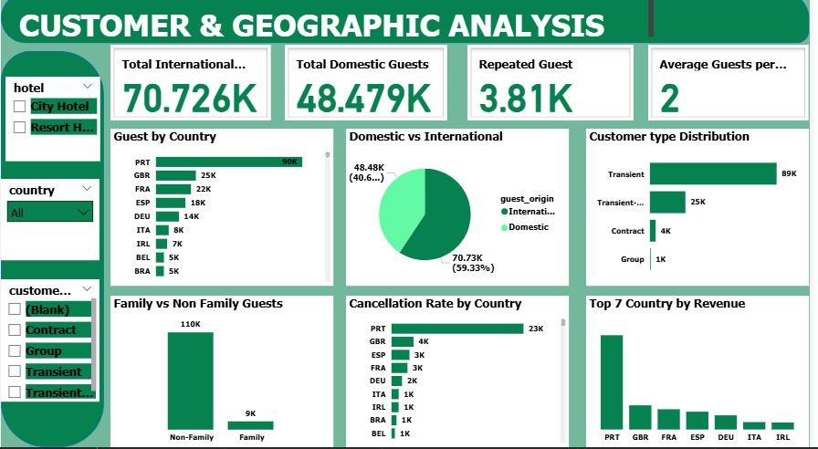
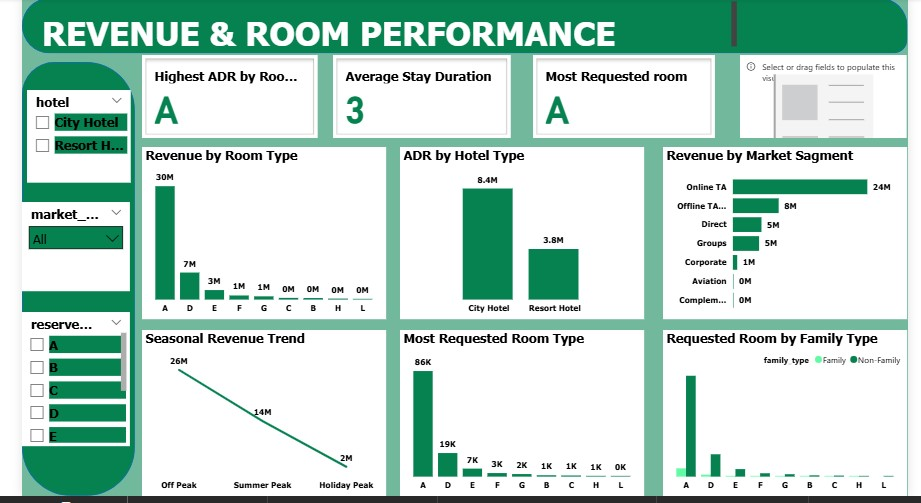
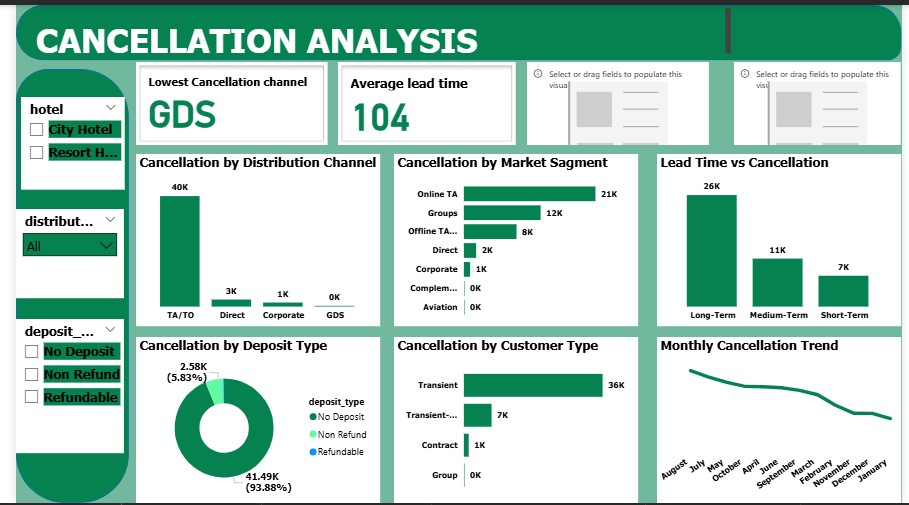
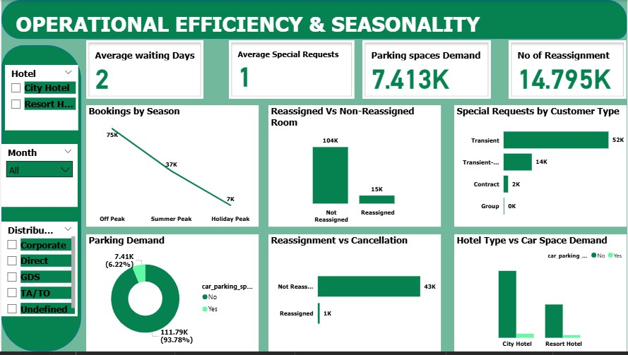

# Hotel-Booking-Analytics
# Project Overview

This project analyzes hotel booking data to uncover insights into customer behavior, revenue performance, cancellation patterns, and operational efficiency. Using SQL and Power BI, the project transforms raw hotel booking data into an interactive business intelligence solution that supports data-driven decision-making.

# Project Objectives

- Analyze booking trends and customer behavior.
- Evaluate revenue performance across hotels and room types.
- Investigate booking cancellations and their causes.
- Assess operational efficiency and seasonality.
- Generate actionable business recommendations.

# Tools Used

- MySQL – Data Cleaning, Transformation, and Modeling
- Power BI – Dashboard Development and Data Visualization
- GitHub – Documentation and Portfolio Management
  
#  Project Workflow

- Data Collection
- Data Cleaning and Preparation
- Feature Engineering
- Data Modeling (Star Schema)
- Business Analysis
- Dashboard Development
- Insights and Recommendations

# Dashboard Overview
### Hotel Executive Overview

- Total Bookings
- Total Revenue
- Average ADR
- Booking Trends
- Revenue by Hotel
- Market Segment Distribution

## Customer & Geographic Analysis

- Guest Distribution by Country
- Domestic vs International Guests
- Customer Type Analysis
- Revenue by Country

## Revenue & Room Performance

- Revenue by Room Type
- ADR by Hotel Type
- Revenue by Market Segment
- Seasonal Revenue Trends

## Cancellation Analysis

- Cancellation by Distribution Channel
- Cancellation by Market Segment
- Lead Time vs Cancellation
- Deposit Type Analysis
  
## Operational Efficiency & Seasonality

- Room Reassignment Analysis
- Waiting List Analysis
- Parking Demand
- Seasonal Booking Trends
  
# Key Insights
- City Hotels generated the highest revenue and booking volume.
- Portugal was the leading source market.
- Online Travel Agencies contributed the highest number of bookings.
- Room Type A was the most profitable room category.
- Long lead-time bookings experienced higher cancellation rates.
- No-deposit bookings recorded the highest cancellations.
  
# Business Recommendations

- Promote high-performing room categories.
- Strengthen marketing in top-performing countries.
- Encourage deposit-based reservations.
- Develop customer loyalty programs.
- Improve cancellation management strategies.

# Author

## Christopher Stanley
Capstone Project – CTH Talent Pool Mentorship Program
Data Analytics Track
